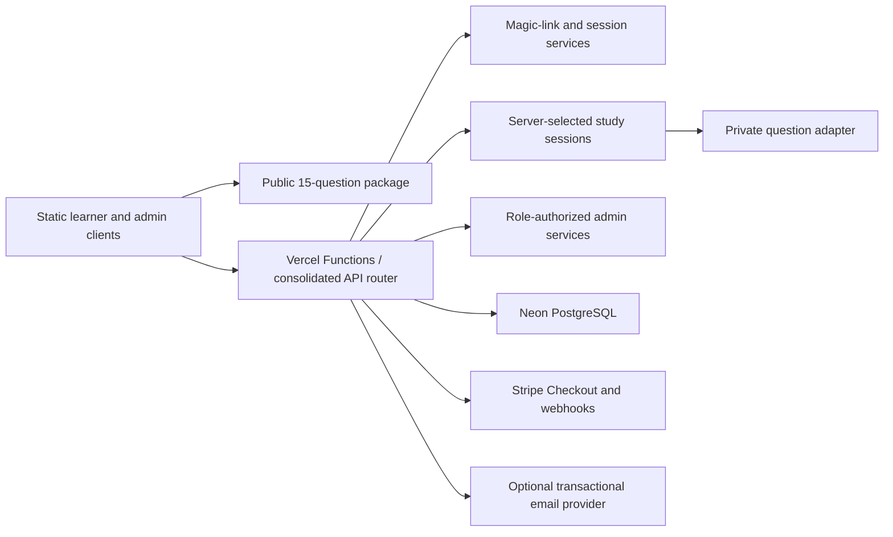
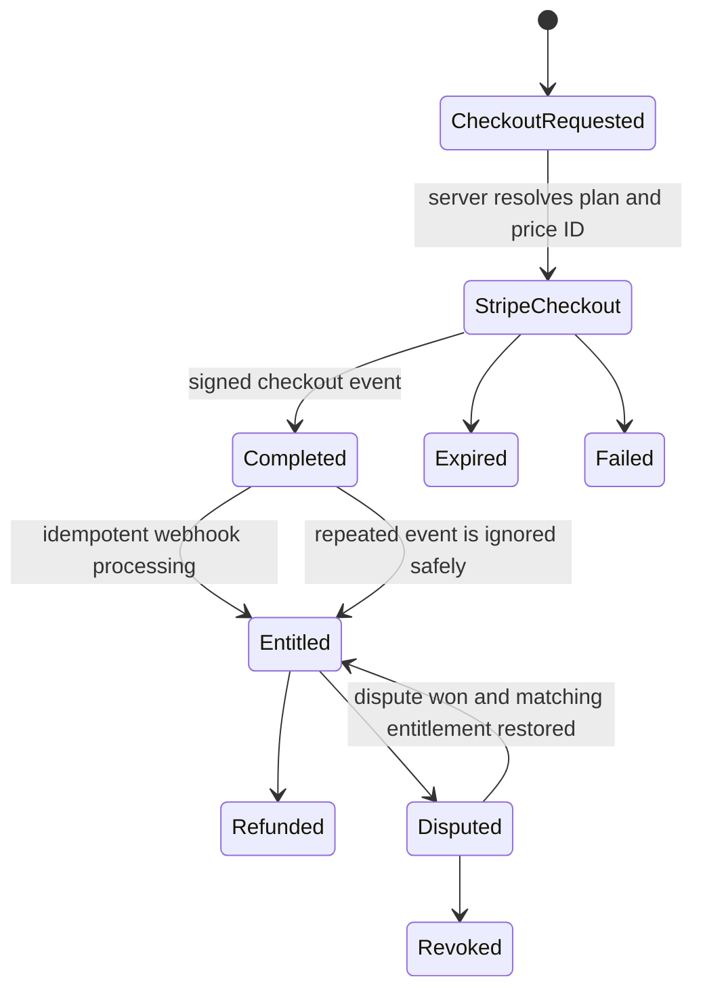

# Irish Theory Test Coach Architecture

## Product Boundary

Irish Theory Test Coach is a static-first learning application with Vercel Functions for privileged behavior and PostgreSQL for durable account, entitlement, progress, payment, support, and audit state.

The public preview is live at [irishtheorycoach.ie](https://irishtheorycoach.ie). A live URL does not make every commercial flow production-verified. Provider-backed payment, email, backup, monitoring, and operator-run recovery checks remain release gates.



## Authentication Flow

```mermaid
sequenceDiagram
  participant L as Learner browser
  participant A as Auth API
  participant D as PostgreSQL
  participant E as Email provider
  L->>A: Request sign-in link for email
  A->>D: Store hashed, single-use token with expiry
  A->>E: Send link when provider is configured
  L->>A: Consume raw token
  A->>D: Lock and consume token; create/rotate session
  A-->>L: Secure HttpOnly SameSite session cookie
  L->>A: Request account or premium study route
  A->>D: Resolve active session, role, and entitlement
  A-->>L: Scoped response or generic denial
```

The browser does not use a local flag as proof of paid access. Passwordless delivery and real cross-device restoration still require a configured email provider and staging verification.

## Payment-State Flow



The repository has mock/static tests for the state model, signatures, idempotency, refunds, disputes, and repeat purchases. A real Stripe test-mode matrix against an isolated database is still required before paid launch.

## Content and Study Sessions

The build publishes a limited preview package without correct-answer fields. Premium study sessions are selected on the server, answer disclosure follows submission, and result calculation is server-owned. Content tooling validates structure, duplicates, answer variants, categories, unsafe HTML, explanations, image descriptions, provenance fields, and generated-output drift.

The product is independent and is not affiliated with RSA or Prometric. Question counts prove dataset size, not official coverage, factual certification, or likely exam frequency.

## Database and Migrations

- `database/schema.sql` describes the current baseline.
- `database/migrations/` contains ordered, checksum-tracked migrations.
- `npm run check:migrations` validates order, checksums, and a dry-run expansion.
- `npm run db:migrate` requires an explicit `DATABASE_URL`.

Apply changes to a disposable Neon branch first. Confirm `schema_migrations` checksums, run the full QA suite, back up the target, and use the reviewed release window before production. Rollback guidance lives in [docs/operations/rollback-runbook.md](docs/operations/rollback-runbook.md).

## Environment Boundaries

| Environment | Purpose | Credential rule |
| --- | --- | --- |
| Local | Static UI, mock API, generation, unit and browser checks | No production credentials. Use `.env.example` names only. |
| Pull request | Lockfile, build, content, security, browser, and accessibility checks | Must remain credential-free. |
| Preview/staging | Provider and database integration checks | Use isolated database, Stripe test mode, test email domain, and scoped secrets. |
| Production | Public custom domain and approved operations | Environment-protected secrets, explicit release dispatch, recorded evidence, and rollback plan. |

Production-only reconciliation is a manually dispatched workflow. It fails clearly when `DATABASE_URL` is absent; it is not scheduled until the required environment is configured.

## Test Strategy

`npm run qa` covers dataset validation, generated assets, content quality, stale output, PWA, compliance, growth/SEO, performance budgets, source register, security headers, lockfile and migration checks, secret patterns, unit/API/webhook/security/admin/accessibility flows, end-to-end behavior, and visual baselines.

Playwright is a declared development dependency. Pull-request and main-branch workflows install Chromium explicitly before browser checks.

Some checks are simulations. Provider-backed verification must be recorded separately and never inferred from a green mock suite.

## Admin and Operator Workflow

Admin routes use server-side role authorization for users, purchases, entitlements, content quality, support, analytics, and audit records. The route inventory and responsibilities are documented in [docs/admin-dashboard.md](docs/admin-dashboard.md) and [docs/admin-operations.md](docs/admin-operations.md).

Operations guidance:

- [release runbook](docs/operations/release-runbook.md)
- [payment reconciliation](docs/operations/payment-reconciliation.md)
- [incident response](docs/operations/incident-runbook.md)
- [backup and restore](docs/operations/backup-restore.md)
- [secret rotation](docs/security/secret-rotation.md)

## Known Limitations

- Paid commerce is not treated as launch-verified by this repository audit.
- The public operator location is intentionally coarse; a suitable non-residential service address and legal advice are needed before paid launch.
- Real email delivery, cross-device restore, Stripe journeys, reconciliation, backup restore, monitoring alerts, and support operations require owner-run environment checks.
- Content quality automation cannot certify legal accuracy or official exam relevance.
- The static frontend remains sizeable and needs continued modularization as behavior grows.
- Current branch/default-branch cleanup requires a reviewed merge into `main` and a manual GitHub default-branch change.

## Release Checklist

1. Install from `package-lock.json` and install the declared Chromium browser.
2. Run `npm run qa` and `npm run security:audit`.
3. Resolve every generated launch blocker and personally review the legal/content output.
4. Migrate and test against an isolated database branch.
5. Run real Stripe test-mode, email, restore, admin, and reconciliation journeys.
6. Deploy the tested commit and run `npm run smoke:postdeploy -- https://irishtheorycoach.ie`.
7. Record deployment ID, commit, environment, checks, and unresolved limitations.
8. Keep the previous known-good deployment available for rollback.

