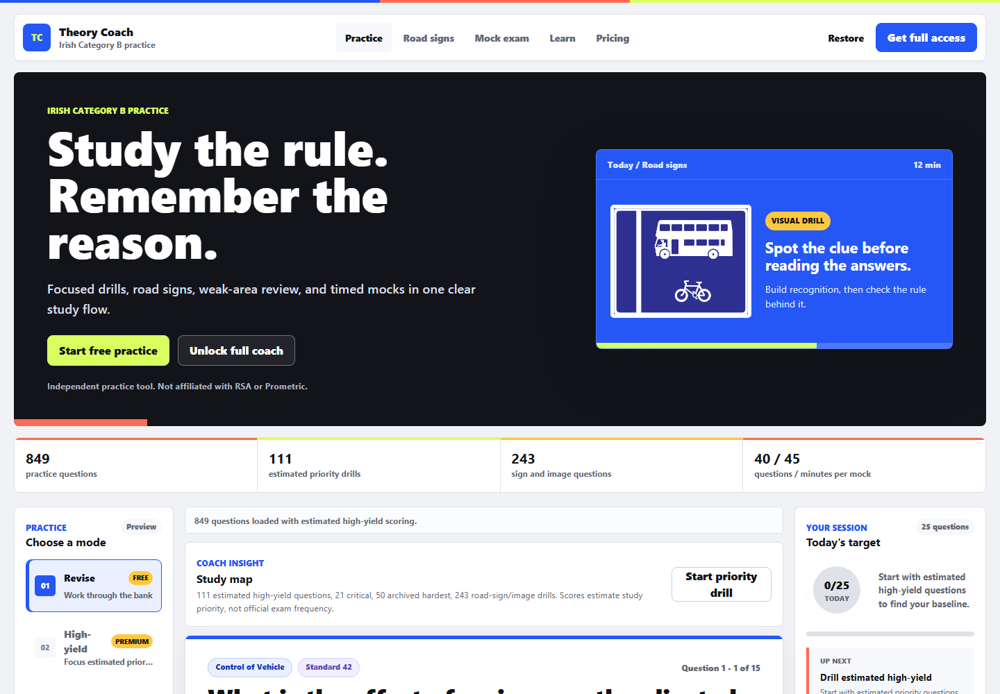
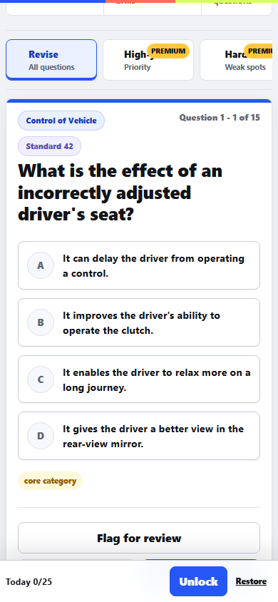
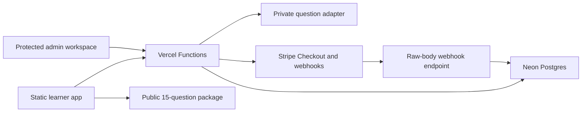

# Irish Theory Test Coach

I built Irish Theory Test Coach as a pre-launch learning product for Irish Category B learner drivers. It started as a question-recovery project and grew into a deployed preview with protected-content boundaries, timed mock exams, progress coaching, passwordless-account flows, payment integration, instructor-code logic, and operator tooling.

This repository is public as an engineering case study. It shows how I approach product design, backend security, payment-state modelling, content operations, accessibility, SEO, and explicit release gates in one system.

> **Independent practice tool. Not affiliated with RSA or Prometric.** The product does not guarantee a pass or claim to know official exam frequency.

## Try It

- **Public preview:** [Open Irish Theory Test Coach](https://irishtheorycoach.ie)
- **Learner workspace:** [Start the 15-question preview](https://irishtheorycoach.ie/app)
- **Pricing surface:** [View the current plan presentation](https://irishtheorycoach.ie/pricing)
- **Learning hub:** [Browse the study guides](https://irishtheorycoach.ie/learn)

The custom `.ie` domain is active. The product should still be treated as a public pre-launch preview: this remediation did not execute a real Stripe test-mode purchase, webhook, refund, dispute, or instructor-code journey against the deployed database.



<p align="center">
  
</p>

## What I Built

The learner experience includes:

- 1,277 structured practice questions across the Category B topic bank
- a 15-question free preview that does not expose premium answer keys
- estimated-priority, hardest, road-sign, review, and revision modes
- server-generated 40-question mock exams with a 45-minute timer
- answer coaching, explanations, memory tips, flags, and missed-question review
- category accuracy, daily targets, study streaks, and recommended next actions
- passwordless account restoration and cross-device progress
- installable PWA support and an offline free-preview shell

The commercial and operator side includes:

- Stripe Checkout for learner passes and instructor code packs
- signed, idempotent Stripe webhook processing
- refund, dispute, and repeat-purchase entitlement handling
- cryptographically generated single-use instructor codes
- server-authorized roles for owners, admins, editors, and support staff
- users, purchases, entitlements, content QA, analytics, support, and audit-log views
- first-party privacy-safe funnel analytics
- static SEO pages, structured data, sitemap generation, and internal-link checks

## The Engineering Work I Am Most Proud Of

### Premium content is actually protected

The browser receives only the free preview before authentication. Premium sessions are selected on the server, correct answers are withheld until submission, mock scoring is calculated server-side, and premium media routes require active access.

### Payment state models failure cases explicitly

Checkout amounts and plan selection are server-authoritative. Webhook code verifies signatures and records idempotency state. The payment model represents completed, failed, expired, refunded, disputed, and replayed events. These paths have automated mock/static coverage; they still require provider-backed test-mode verification before commercial launch.

### Content quality is an operational workflow

The content pipeline detects exact and near duplicates, answer-set variants, conflicting answers, category aliases, malformed options, unsafe HTML, weak explanations, and missing image descriptions. Editorial decisions are versioned and auditable instead of silently changing factual answers.

### Build output cannot quietly drift

Question counts, pricing, access duration, content versions, schema versions, and release metadata are generated from authoritative sources. Stale-build tests fail when marketing copy, public data, pricing, sitemap entries, or generated files disagree.

## Architecture



See [ARCHITECTURE.md](ARCHITECTURE.md) for the authentication flow, payment-state model, environment boundaries, migration procedure, test strategy, deployment checklist, and known limitations.

```text
public/                 Static learner app, marketing pages, PWA, and admin UI
api/                    Vercel entrypoints and consolidated API router
server/api/             Auth, study, payment, analytics, support, and admin handlers
lib/                    Database, security, entitlement, content, and audit helpers
shared/                 Authoritative pricing, product, business, and growth config
database/               Idempotent schema and numbered migrations
data/                   Owned question source data and media
scripts/                Build, validation, QA, migration, evidence, and release tooling
docs/                   Security, operations, content, design, SEO, and launch guides
```

I kept the product in modular vanilla JavaScript instead of migrating frameworks. That kept the runtime small, made the static marketing surface fast, and forced a clear boundary between browser code and privileged server behavior.

## Technology

| Area | Implementation |
| --- | --- |
| Frontend | Semantic HTML, modern CSS, modular vanilla JavaScript |
| Hosting | Vercel static output and serverless Functions |
| Database | Neon Postgres with `pg` and transactional migrations |
| Payments | Stripe Checkout, signed webhooks, internal payment ledger |
| Authentication | Single-use magic links and secure HTTP-only sessions |
| Offline | Service worker, Web App Manifest, versioned preview cache |
| Quality | Node and Python validation, browser tests, axe, visual snapshots |
| SEO | Static HTML, canonical metadata, JSON-LD, sitemap, internal links |

## Verification

The current commercial Preview was tested against the exact deployed Git commit.

| Check | Current result |
| --- | --- |
| Published dataset | 1,277 questions validated |
| Public content exposure | 15 preview questions, no answer key |
| Payment logic | 18 automated mock/static scenarios recorded; real Stripe test-mode journey not verified here |
| Payment reconciliation | 0 unresolved findings |
| Accessibility | 7 states, 0 critical axe violations |
| Visual regression | 15 deterministic mobile, tablet, and desktop screenshots |
| Recorded deployment smoke evidence | 11 routes and behaviours in the previous evidence set; rerun after this branch is deployed |
| Dependency audit | Run again for every release; do not rely on this README as a live vulnerability result |

Run the complete local quality gate with:

```powershell
npm ci
npm run qa
```

That command validates the dataset, generated output, protected-content boundary, payment and webhook behavior, account policies, role authorization, security controls, PWA, SEO, accessibility, end-to-end flows, and visual baselines.

## Run It Locally

Requirements:

- Node.js 22
- npm
- Python 3

```powershell
git clone https://github.com/Assembler-Fourier/irish-theory-test-coach.git
cd irish-theory-test-coach
npm ci
npm run build
npm run dev
```

Open `http://localhost:5173/public/` for the static product. Use `npx vercel dev` when testing serverless APIs locally.

`.env.example` contains placeholders only. Real Stripe, Neon, email, session, and webhook credentials must remain in private environment variables.

## Admin And Security

The admin workspace is not protected by hidden buttons. Every admin endpoint verifies the secure session and server-side role. The Preview owner flow has been tested through token consumption, `/api/me`, protected admin metrics, and logout.

Operational documentation includes:

- [Threat model](docs/security/threat-model.md)
- [Security controls](docs/security/security-controls.md)
- [Incident response](docs/security/incident-response.md)
- [Release runbook](docs/operations/release-runbook.md)
- [Payment reconciliation](docs/operations/payment-reconciliation.md)
- [Admin dashboard](docs/admin-dashboard.md)

## Current Status

The custom domain is active and the free preview is publicly reviewable. The repository is still **pre-launch for paid commerce**. Real provider-backed payment journeys, final legal review, a non-residential business service address, production monitoring, backup evidence, and operator-run release checks remain gates. Generated QA reports describe code and recorded test evidence; they are not a substitute for current production verification.

## About Me

I am Uzair Waseem. I built and maintain this portfolio project across product design, data tooling, frontend UX, serverless APIs, database design, payment integration, authentication, admin operations, automated QA, and deployment.

For hiring conversations, the most useful places to start are the live Preview, the architecture above, and the security/payment modules under `server/api/` and `lib/`.

## Source And Content

The repository is available for portfolio review. Unless a separate licence says otherwise, no licence is granted to reuse the question bank, images, explanations, branding, or other content assets.
